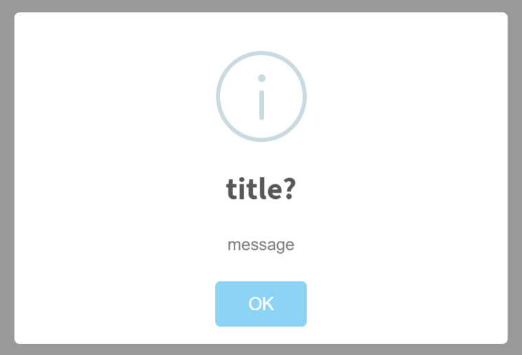

[< Back to tutorial](README.md)

# Frontend Built-in Functions

* ajax
* toAbsAppPath

#### [Auth](#auth-1)
* areAllGranted
* [clearToken](#cleartoken)
* [getToken](#gettoken)
* isAnyGranted
* isGranted
* [setToken](#settoken)

#### [Clock](#clock)
* [normalize](#normalize)
* [now](#now)

#### [Event](#event)
* [off](#off)
* [on](#on)
* [trigger](#trigger)

#### Features
* get
* getValue
* isEnabled

#### Localization
* getSource
* isCurrentCulture
* localize

#### [Log](#log-1)
* [debug](#debug)
* [error](#error)
* [fatal](#fatal)
* [info](#info)
* [log](#log)
* [warn](#warn)

#### [Message](#message-1)
* [confirm](#confirm)
* [error](#error)
* [info](#info)
* [success](#success)
* [warn](#warn)

#### MultiTenancy
* getTenantIdCookie
* setTenantIdCookie

#### Nav
_none_

#### Notifications
* getFormattedMessageFromUserNotification
* getUiNotifyFuncBySeverity
* getUserNotificationStateAsString
* showUiNotifyForUserNotification

#### Notify
* error
* info
* success
* warn

#### Security
* [antiForgery.getToken](#antiforgerygetoken)

#### Setting
* get
* getBoolean
* getInt

#### SignalR
* connect

#### Timing
* convertToUserTimezone

#### UI
* block
* clearBusy
* setBusy
* unblock

#### Utils
* buildQueryString
* createNamespace
* deleteCookie
* formatString
* [getCookieValue](#getCookieValue)
* isFunction
* replaceAll
* [setCookieValue](#setCookieValue)
* toCamelCase
* toPascalCase
* truncateString
* truncateStringWithPostfix

## Auth

### clearToken
```abp.auth.clearToken(): void;```

### getToken
```abp.auth.getToken(): string;```

### setToken
```abp.auth.setToken(authToken: string, expireDate?: Date): void;```
Saves auth token.

## Clock

### normalize
```normalize(date: Date): Date;```

### now
```now(): Date;```

## Log

### debug
```abp.log.debug(logObject?: any): void;```

### error
```abp.log.error(logObject?: any): void;```

### fatal
```abp.log.fatal(logObject?: any): void;```

### info
```abp.log.info(logObject?: any): void;```

### log
```abp.log.log(logObject?: any, logLevel?: levels): void;```

### warn
```abp.log.warn(logObject?: any): void;```

## Message

### confirm
```abp.message.confirm(message: string, callback?: (result: boolean) => void): Promise;```

```abp.message.confirm(message: string, title?: string, callback?: (result: boolean) => void): Promise;```

### error
```abp.message.error(message: string, title?: string): Promise;```

### info
```abp.message.info(message: string, title?: string): Promise;```



### success
```abp.message.success(message: string, title?: string): Promise;```

### warn
```abp.message.warn(message: string, title?: string): Promise;```

## Notify

Generate a pop-up notification in the bottom-right corner that doesn't prevent the user from using the rest of the system. After a short time the notification fades away.

Multiple notifications above each other and can be clicked on to make them fade immediately.

### error
```abp.notify.error(message: string, title?: string, options?: any): void;```

Generates an error notification

### info
```abp.notify.info(message: string, title?: string, options?: any): void;```

Generates an information notification


### success
```success(message: string, title?: string, options?: any): void;```

Generates a success notification

### warn
```abp.notify.warn(message: string, title?: string, options?: any): void;```

Generates a warning notification

## Utils

### getCookieValue
```abp.utils.getCookieValue(key: string): string;```

Gets a cookie with given key.
This is a simple implementation created to be used by ABP.
Please use a complete cookie library if you need.

### setCookieValue
```abp.utils.setCookieValue(key: string, value: string, expireDate?: Date, path?: string): void;```

Sets a cookie value for given key.
This is a simple implementation created to be used by ABP.
Please use a complete cookie library if you need.

[< Back to tutorial](README.md)