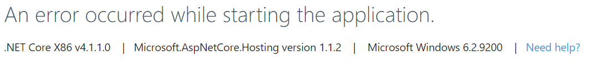

# Deploying to Azure
This article describes how to deploy ASP\.NET Boilerplate Core & Angular to Microsoft Azure; as well as how to troubleshoot typical issues.

## One Site Deployment
It's technically possible to merge the angular site and ASP\.NET Core site together into a single solution. The process has been described in an [ASP\.NET Zero article](https://www.aspnetzero.com/Documents/Merge-Angular-Client-Server).

## Two Site Deployment
Possibly an easier process is a two site deployment with two different AppServices (one for the backend and one for the frontend) and a SQL database.

* __Backend__
  * Create server App Service & Database
  * Create publish profile in Visual Studio 2017
  * Update Startup for CORS
  * Update Connection Strings
  * Publish from Visual Studio 2017
  * Run database update
* __Frontend__
  * Create client App Service
  * Enable CORS on server App Service
  * Update appconfig.json
  * Build Angular project
  * Create web.config
  * FTP to App Service

### Backend

#### 1. Run database update
Unfortunately you must manually run the database updates on the server. Luckily, we can use the EF CLI in the .EntityFrameworkCore project to update the server.

### Frontend
Now let's upload the Angular project to Azure.

#### 1. Enable CORS App Service Config
Enable CORS on the server AppService.

#### 2. Update appconfig.json
Edit __/angular/src/assets/appconfig.json__ and set ```remoteServiceBaseUrl``` and ```appBaseUrl```.

#### 3. Build Angular Project
Run ```npm run ng build``` to create a distribution of the Angular project.

#### 4. Create web.config
Create a __web.config__ file in the newly created __/dist__ directory in __/angular__. Populate with config file with the code below. This will allow Angular routing.

```xml
<?xml version="1.0" encoding="utf-8"?>
<configuration>
  <system.webServer>
    <staticContent>
      <remove fileExtension=".json" />
      <mimeMap fileExtension=".json" mimeType="application/json" />
      <mimeMap fileExtension=".woff" mimeType="application/x-font-woff" />
      <mimeMap fileExtension=".woff2" mimeType="application/x-font-woff" />
    </staticContent>
    <rewrite>
      <rules>
        <rule name="Routes" stopProcessing="true">
          <match url=".*" />
          <conditions logicalGrouping="MatchAll">
            <add input="{REQUEST_FILENAME}" matchType="IsFile" negate="true" />
            <add input="{REQUEST_FILENAME}" matchType="IsDirectory" negate="true" />
            <add input="{REQUEST_URI}" pattern="^/(api)" negate="true" />
          </conditions>
          <action type="Rewrite" url="/" />
        </rule>
      </rules>
    </rewrite>  
  </system.webServer>
</configuration>
```

## Troubleshooting the Backend


The error message above is what you can expect to see if there was a problem deploying the backend to Azure.

It is not necessary to install Application Insights for ABP on Azure because of the logging already implemented in the template.

Login via FTP to the backend webapp and navigate to ```/site/wwwroot/App_Data/Logs``` and download **Logs.txt**. Open the text file in your favourite text editor and scroll up from the bottom of the file until you find an exception.

## See Also
* [ASP\.NET Boilerplate Tutorials](README.md)
* [How to Initialize and Run a Clean Template](cleantemplate.md)
* __2.1.2__ [Using Docker to deploy to Azure](docker212.md)